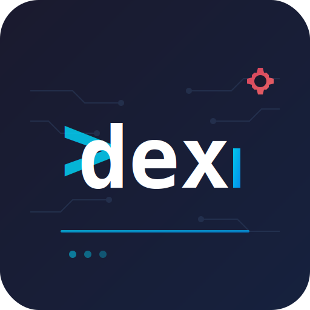

<div align="center">



### **dex** — a new developer experience

*Swiss army knife for engineers and AI agents*

</div>

---

## For Humans

```bash
# Install
go install github.com/codewandler/dex@latest

# Get started
dex -h                         # Show help
dex setup                      # Configure integrations
dex doctor                     # Check integration health

# Examples
dex k8s pod ls -A              # List all pods
dex gl mr ls                   # List open MRs
dex jira my                    # My assigned issues
```

## For AI Agents

This CLI is primarily designed as a tool for AI agents (Claude, etc.) to interact with engineering infrastructure. It ships with a Claude Code skill at `.claude/skills/dex/` that provides full command documentation.

Invoke via `/dex` in Claude Code, or see `CLAUDE.md` for development info.

## Requirements

- Go 1.21+
- [Task](https://taskfile.dev)
- Environment variables for each integration (see `CLAUDE.md`)
